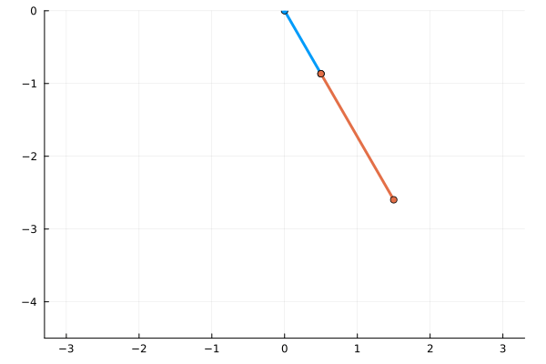

# Double pendulum simulator
Uses 4th-order Runge-Kutta to numerically solve the Euler-Lagrange equations, derived from

$$\begin{align*}
T_1 &= \frac12 m_1 l_1^2 \dot\theta^2 \\
T_2 &= \frac12 m_2 (l_1^2 \dot\theta^2 + l_2^2 \dot\varphi^2
    + 2l_1 l_2 \dot\theta \dot\varphi \cos (\varphi - \theta)) \\
V_1 &= m_1 g l_1 (1 - \cos \theta) \\
V_2 &= m_2 g (l_1 (1 - \cos \theta) + l_2 (1 - \cos \varphi))
\end{align*}$$
$$\mathcal{L} = T_1 + T_2 - V_1 - V_2$$

