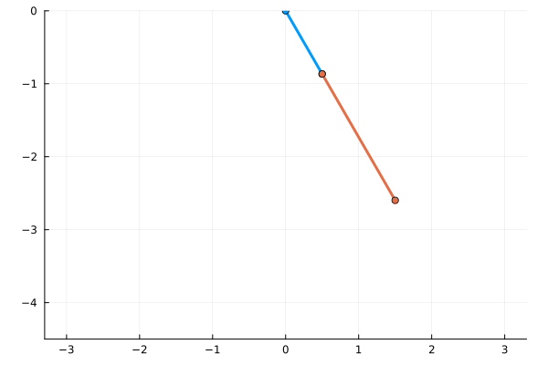

# Double pendulum simulator
Uses 4th-order Runge-Kutta to numerically solve the Euler-Lagrange equations.

The system is described by:
$$\begin{align*}
    T_1 &= \frac12 m_1 l_1^2 \dot\theta^2, \\
    T_2 &= \frac12 m_2 (l_1^2 \dot\theta^2 + l_2^2 \dot\varphi^2
        + 2l_1 l_2 \dot\theta \dot\varphi \cos (\varphi - \theta)), \\
    V_1 &= m_1 g l_1 (1 - \cos \theta), \\
    V_2 &= m_2 g (l_1 (1 - \cos \theta) + l_2 (1 - \cos \varphi)),
\end{align*}$$

and the Lagrangian is given by
$$\mathcal{L} = T_1 + T_2 - V_1 - V_2.$$

The Euler-Lagrange equations are
$$\begin{align*}
    \frac{\partial \mathcal{L}}{\partial \theta}
    &= \frac{\mathrm{d}}{\mathrm{d} t}\frac{\partial \mathcal{L}}{\partial \dot\theta}, \\
    \frac{\partial \mathcal{L}}{\partial \varphi}
    &= \frac{\mathrm{d}}{\mathrm{d} t} \frac{\partial \mathcal{L}}{\partial \dot\varphi}.
\end{align*}$$

